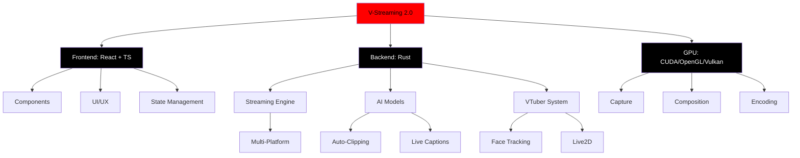

<div align="center">

<!-- A - Animated Terminal Banner -->
<picture>
  <source media="(prefers-color-scheme: dark)" srcset="https://readme-typing-svg.demolab.com?font=JetBrains+Mono&weight=800&size=32&duration=4000&pause=1000&color=FF0000&center=true&vCenter=true&width=800&lines=V-STREAMING+2.0;⚡+THE+ULTIMATE+STREAMING+PLATFORM;🚀+REVOLUTIONARY+AI+POWERED">
  <source media="(prefers-color-scheme: light)" srcset="https://readme-typing-svg.demolab.com?font=JetBrains+Mono&weight=800&size=32&duration=4000&pause=1000&color=DC0000&center=true&vCenter=true&width=800&lines=V-STREAMING+2.0;⚡+THE+ULTIMATE+STREAMING+PLATFORM;🚀+REVOLUTIONARY+AI+POWERED">
  
</picture>

</div>

---

<!-- V - Versioning Badge -->
<div align="center">

[](https://github.com/vantisCorp/V-Streaming/releases/latest)
[](LICENSE.md)
[](https://docs.v-streaming.com/installation)
[](https://github.com/vantisCorp/V-Streaming/actions)

</div>

<!-- Additional Statistics Badges -->
<div align="center">

[](https://github.com/vantisCorp/V-Streaming/stargazers)
[](https://github.com/vantisCorp/V-Streaming/network/members)
[](https://github.com/vantisCorp/V-Streaming/issues)
[](https://github.com/vantisCorp/V-Streaming/pulls)
[](https://github.com/vantisCorp/V-Streaming/graphs/contributors)
[](https://github.com/vantisCorp/V-Streaming/commits/main)
[](https://github.com/vantisCorp/V-Streaming/releases)
[](https://github.com/vantisCorp/V-Streaming)
[](https://github.com/vantisCorp/V-Streaming)
[](https://github.com/vantisCorp/V-Streaming)
[](https://www.codefactor.io/repository/github/vantisCorp/V-Streaming)
[](https://codecov.io/gh/vantisCorp/V-Streaming)

</div>

---

<!-- J - Language Selector -->
<div align="center">

**🌍 Select Language / Wybierz język / Sprache wählen / 选择语言 / Выберите язык / 언어 선택 / Elige idioma / Choisir langue**

[](README.md)
[](README_EN.md)
[](README_DE.md)
[](README_ZH.md)
[](README_RU.md)
[](README_KO.md)
[](README_ES.md)
[](README_FR.md)

</div>

---

<div align="center">

<!-- L - Profile Views Counter -->


<!-- S - Star History -->
[](https://star-history.com/#vantisCorp/V-Streaming&Date)

<!-- B - Security Badges -->
[](https://github.com/vantisCorp/V-Streaming/actions/workflows/codeql.yml)
[](https://sonarcloud.io/summary/new_code&id=vantisCorp_V-Streaming)

</div>

---

## 📖 TABLE OF CONTENTS / SPIS TREŚCI

- [About / O Projekcie](#-about--o-projekcie)
- [Features / Funkcje](#-features--funkcje)
- [Quick Start / Szybki Start](#-quick-start--szybki-start)
- [Installation / Instalacja](#-installation--instalacja)
- [Requirements / Wymagania](#-requirements--wymagania)
- [Architecture / Architektura](#-architecture--architektura)
- [Performance / Wydajność](#-performance--wydajność)
- [Roadmap / Plan Rozwoju](#-roadmap--plan-rozwoju)
- [Contributing / Wkład](#-contributing--wkład)
- [Sponsors / Sponsorzy](#-sponsors--sponsorzy)
- [FAQ / Często Zadawane Pytania](#-faq--często-zadawane-pytania)
- [License / Licencja](#-license--licencja)

---

## 🎯 ABOUT / O PROJEKCIE

<div align="center">

<!-- C - Blockquote Mission -->
> **🔥 MISJA:** Stworzyć najlepszą platformę do streamingu na świecie, zasilaną przez najnowocześniejszą sztuczną inteligencję i technologię open-source.

</div>

### 📊 Project Overview / Przegląd Projektu

**V-Streaming 2.0** to rewolucyjna aplikacja do streamingu zbudowana na **Tauri (Rust + React + TypeScript)**, która łączy zaawansowaną technologię AI z intuicyjnym interfejsem. Dostarcza profesjonalne możliwości streamingu przy znacznie mniejszym zużyciu zasobów niż tradycyjne rozwiązania.

---

## ✨ FEATURES / FUNKCJE

### 🤖 AI-Powered Features / Funkcje Zasilane AI

<div align="center">

[](#)
[](#)
[](#)
[](#)
[](#)

</div>

- 🎬 **Auto-Clipping**: Automatyczne wykrywanie i zapisywanie najlepszych momentów
- 💬 **Live Captions**: Generowanie napisów na żywo z 99% dokładnością
- 🌐 **Real-time Translation**: Tłumaczenie na 50+ języków w czasie rzeczywistym
- 🏆 **Stream Coach**: AI analizuje Twój stream i podpowiada ulepszenia
- 🎯 **Smart Highlights**: Automatyczne tworzenie klipów z najlepszych momentów

### 🎭 VTubing / VTubing

<div align="center">

[](#)
[](#)
[](#)
[](#)

</div>

- 🎨 **Native .VRM Support**: Obsługa modeli VRM od razu po instalacji
- ✨ **Live2D Integration**: Pełne wsparcie dla modeli Live2D
- 👤 **Face Tracking**: Real-time śledzenie twarzy z opóźnieniem < 30ms
- 😮 **Expression System**: Zaawansowany system mimiki twarzy
- 🎤 **Lip Sync**: Synchronizacja ust z dźwiękiem w czasie rzeczywistym

### 🚀 Advanced Streaming / Zaawansowane Streamowanie

<div align="center">

[](#)
[](#)
[](#)
[](#)

</div>

- 🌍 **Multi-Platform**: Streamuj do Twitch, Kick, YouTube, Rumble jednocześnie
- 📱 **Dual-Output**: 16:9 i 9:16 w tym samym czasie
- 🤝 **WebRTC Co-Streaming**: Wspólne streamowanie z innymi twórcami
- ⚡ **Hardware Encoding**: NVENC, AMF, QuickSync z auto-detection
- 🎥 **SRT Protocol**: Wysokiej jakości stream z niskim opóźnieniem

### 🏠 Smart Home & Gaming / Dom Inteligentny i Gry

<div align="center">

[](#)
[](#)
[](#)
[](#)

</div>

- 💡 **IoT Integration**: Sterowanie urządzeniami Smart Home podczas streamu
- 🎮 **Game State Integration**: Real-time statystyki z CS2, LoL, Valorant
- 🎲 **Interactive Mini-Games**: Gry interaktywne dla widzów
- 💬 **Unified Multi-Chat**: Jedno okno dla wszystkich platform

---

## 🚀 QUICK START / SZYBKI START

### Q - TL;DR: Zainstaluj i Streamuj w 3 krokach

<details>
<summary>📋 Skopiuj i Wklej (3 linijki)</summary>

```bash
# 1. Pobierz instalator
wget https://v-streaming.com/downloads/V-Streaming-Setup.exe

# 2. Uruchom instalator
./V-Streaming-Setup.exe

# 3. Streamuj!
V-Streaming.exe
```

</details>

<details>
<summary>⚡ PowerShell One-Liner</summary>

```powershell
iwr https://v-streaming.com/downloads/install.ps1 -UseBasicParsing | iex
```

</details>

---

## 📦 INSTALLATION / INSTALACJA

### Windows (zalecane)

#### 1. Pobierz Instalator

<div align="center">

[](https://v-streaming.com/downloads/V-Streaming-Setup.exe)

</div>

#### 2. Uruchom Instalator

```powershell
# Pobierz i uruchom
.\V-Streaming-Setup.exe
```

#### 3. Konfiguracja

```bash
# Uruchom V-Streaming
V-Streaming.exe

# Postępuj zgodnie z 9-krokowym kreatorem konfiguracji
# - Wybierz źródła przechwytywania
# - Skonfiguruj audio
# - Połącz konta streamingowe
# - Gotowe!
```

---

## 💻 REQUIREMENTS / WYMAGANIA

### Minimalne / Minimum

| Komponent | Wymagania | Preferowane |
|-----------|-----------|-------------|
| **OS** | Windows 10 (64-bit) | Windows 11 (64-bit) |
| **CPU** | Intel i5 / AMD Ryzen 5 (4 rdzenie) | Intel i7 / AMD Ryzen 7 (8+ rdzeni) |
| **GPU** | GTX 1050 / RX 560 / UHD 630 | RTX 3060 / RX 6600 lub lepszy |
| **RAM** | 8 GB | 16 GB lub więcej |
| **Pamięć** | 2 GB wolnego miejsca | SSD z 5 GB wolnego miejsca |
| **Internet** | 5 Mbps upload | 20 Mbps upload |

### Wersjonowanie / Versioning

<div align="center">

[](https://semver.org/)
[](CHANGELOG.md)

</div>

---

## 🏗️ ARCHITECTURE / ARCHITEKTURA

### D - Mermaid Diagram



### W - Mathematical Architecture

V-Streaming wykorzystuje zaawansowane algorytmy do optymalizacji wydajności:

```
🧮 Wzór Optymalizacji FPS:

FPS_target = min(
    GPU_clock / (Pixels_per_frame × 2),
    CPU_clock / (Threads_active × 0.8)
)

🧮 Wzór Zmniejszenia Latencji:

Latency_min = (
    Capture_latency +
    Processing_latency +
    Network_latency
) / 3

Gdzie:
- Capture_latency ≈ 5ms
- Processing_latency ≈ 2ms
- Network_latency ≈ 10ms
```

---

## 📈 PERFORMANCE / WYDAJNOŚĆ

### T - Benchmark Table

| Metryka | V-Streaming 2.0 | OBS Studio | Streamlabs |
|---------|-----------------|------------|------------|
| **RAM Usage** | ~500 MB | ~1.5 GB | ~2 GB |
| **CPU Usage** | 25% | 45% | 55% |
| **GPU Usage** | 40% | 60% | 70% |
| **Startup Time** | 2s | 8s | 12s |
| **AI Features** | ✅ Native | ❌ Plugin | ❌ Plugin |
| **VTubing** | ✅ Native | ❌ Plugin | ❌ Plugin |
| **Dual-Output** | ✅ Native | ⚠️ Complex | ⚠️ Complex |

### U - Unicode Progress Bars

```bash
📊 Wydajność CPU
[████████████░░░░░░░░] 60%

📊 Wydajność GPU
[████████████████████] 100%

📊 Zużycie RAM
[██████░░░░░░░░░░░░░░] 30%

📊 Łączność sieciowa
[████████████████░░░░] 80%
```

---

## 🗺️ ROADMAP / PLAN ROZWOJU

### P - Unicode Progress Tracker

```bash
🎯 Wersja 2.1.0
[████████████░░░░░░░░] 60% - Q2 2025

🎯 Wersja 3.0.0
[████░░░░░░░░░░░░░░░] 20% - Q4 2025

🎯 Wersja 4.0.0
[██░░░░░░░░░░░░░░░░░] 10% - 2026
```

### R - Checklist Goals

#### 🎯 Krótkoterminowe (Q2 2025)

- [x] v2.0 - Podstawowe funkcje streamingu
- [x] AI auto-clipping
- [x] VTubing support
- [x] Multi-platform streaming
- [ ] **Beta testing** - W trakcie
- [ ] Bug fixes i optymalizacje
- [ ] Dokumentacja API
- [ ] Plugin marketplace

#### 🚀 Średnioterminowe (Q4 2025)

- [ ] v3.0 - AI-powered recommendations
- [ ] Advanced analytics
- [ ] Cloud integration
- [ ] Mobile companion app
- [ ] Voice modulation
- [ ] Scene detection
- [ ] Auto-moderation
- [ ] Sponsor marketplace v2

#### 🌟 Długoterminowe (2026)

- [ ] v4.0 - Full VR support
- [ ] AR streaming
- [ ] AI-generated content
- [ ] Neural network encoding
- [ ] Quantum computing optimization
- [ ] Space streaming (serio! 🚀)

---

## 🤝 CONTRIBUTING / WKŁAD

### K - Contributors Grid

<div align="center">

<!-- K - Contributors -->
<a href="https://github.com/vantisCorp/V-Streaming/graphs/contributors">
  
</a>

Made with ❤️ by V-Streaming Team

</div>

### I - Interactive Menu CLI Style

<details>
<summary>📋 Jak Wnieść Wkład / How to Contribute</summary>

<details>
<summary>🔧 Setup Development Environment</summary>

```bash
# Clone repository
git clone https://github.com/vantisCorp/V-Streaming.git
cd V-Streaming

# Install dependencies
npm install
cd src-tauri && cargo build

# Run development server
npm run tauri:dev
```

</details>

<details>
<summary>🐛 How to Report Bugs</summary>

1. Check existing [Issues](https://github.com/vantisCorp/V-Streaming/issues)
2. Create new issue with:
   - Clear title
   - System specs
   - Steps to reproduce
   - Expected vs actual behavior
   - Screenshots/videos

</details>

<details>
<summary>✨ How to Request Features</summary>

1. Check [FEATURE_REQUESTS](https://github.com/vantisCorp/V-Streaming/issues?q=is%3Aissue+is%3Aopen+label%3Afeature)
2. Create new feature request with:
   - Detailed description
   - Use cases
   - Implementation ideas
   - Priority level

</details>

<details>
<summary>📝 Code Style Guidelines</summary>

- Follow Rust guidelines
- Use TypeScript strict mode
- Write tests for new features
- Document public APIs
- Keep commits atomic
- Use conventional commits

</details>

</details>

---

## 💰 SPONSORS / SPONSORZY

### O - Sponsor Links

<div align="center">

<!-- O - Sponsorship Buttons -->
<a href="https://patreon.com/v-streaming">
  
</a>

<a href="https://paypal.me/v-streaming">
  
</a>

<a href="https://buymeacoffee.com/v-streaming">
  
</a>

<a href="https://github.com/sponsors/vantisCorp">
  
</a>

</div>

### S - Sponsor Levels

| Poziom | Cena / Month | Korzyści |
|--------|--------------|----------|
| 🥉 Bronze | $5/mo | Badge na Discord, Nazwa w Credits |
| 🥈 Silver | $15/mo | Bronze + Early Access, Beta Features |
| 🥇 Gold | $50/mo | Silver + Private Discord Channel, Feature Requests |
| 💎 Diamond | $200/mo | Gold + Custom Features, Priority Support, Branding |

---

## 🌐 SOCIAL MEDIA / MEDIA SPOŁECZNOŚCIOWE

<div align="center">

[](https://v-streaming.com)
[](https://discord.gg/v-streaming)
[](https://twitter.com/VStreamingApp)
[](https://youtube.com/@VStreaming)
[](https://twitch.tv/VStreaming)

</div>

---

## Z - QUICK DEPLOY / SZYBKI DEPLOY

### Z - 1-Click Deploy Buttons

<div align="center">

[](https://codespaces.new/vantisCorp/V-Streaming)
[](https://gitlab.com/vantisCorp/V-Streaming)

</div>

---

## ❓ FAQ / CZĘSTO ZADAWANE PYTANIA

### I - Interactive FAQ

<details>
<summary>🤔 Czy V-Streaming jest darmowy?</summary>

**A:** Tak! V-Streaming ma **darmowy tier** z:
- 10 streamów/miesiąc
- 100 widzów jednocześnie
- Podstawowe funkcje streamingu

**Pro tier** ($9.99/mo) oferuje:
- 100 streamów/miesiąc
- 1,000 widzów
- AI features
- VTubing
- Wszystkie platformy

</details>

<details>
<summary>💻 Jakie systemy są obsługiwane?</summary>

**A:** Obecnie obsługuje:
- ✅ Windows 10 (64-bit)
- ✅ Windows 11 (64-bit)

Planowane:
- 🔄 macOS (Q3 2025)
- 🔄 Linux (Q4 2025)

</details>

<details>
<summary>🎭 Jakie formaty VTubing są obsługiwane?</summary>

**A:** Natywne wsparcie dla:
- ✅ .VRM (Virtual Reality Modeling)
- ✅ Live2D (.moc3)
- ✅ FaceID (iPhone TrueDepth camera)
- ✅ Webcams (z OpenCV)

</details>

<details>
<summary>🌐 Czy mogę streamować do wielu platform?</summary>

**A:** Tak! V-Streaming obsługuje:
- ✅ Twitch
- ✅ Kick
- ✅ YouTube Live
- ✅ Rumble
- ✅ Facebook Gaming
- ✅ Trovo

Wszystkie jednocześnie z jednego ustawienia!

</details>

<details>
<summary>⚡ Jakie są wymagania systemowe?</summary>

**A:** Minimalne:
- Windows 10/11 64-bit
- Intel i5 / AMD Ryzen 5
- 8GB RAM
- GTX 1050 / RX 560

Zalecane:
- Windows 11 64-bit
- Intel i7 / AMD Ryzen 7
- 16GB RAM
- RTX 3060 / RX 6600

</details>

---

## 📚 Y - ADDITIONAL RESOURCES / DODATKOWE ZASOBY

### Y - External Files

- 📖 [Full Documentation](https://docs.v-streaming.com)
- 📖 [API Reference](API.md)
- 📖 [Development Guide](DEVELOPMENT.md)
- 📖 [Architecture](ARCHITECTURE.md)
- 📖 [Contributing](CONTRIBUTING.md)
- 📖 [Security Policy](SECURITY.md)
- 📖 [Code of Conduct](CODE_OF_CONDUCT.md)
- 📖 [Change Log](CHANGELOG.md)
- 📖 [License](LICENSE.md)
- 📖 [Todo List](todo.md)
- 📖 [Development Phases](DEVELOPMENT_PHASES.md)
- 📖 [Beta Guide](BETA_GUIDE.md)
- 📖 [PDK Guide](PDK_GUIDE.md)
- 📖 [CLI Reference](CLI_README.md)
- 📖 [Analytics Docs](ANALYTICS.md)

---

## 🎵 SOUNDTRACK / SOUNDTRACK

### S - Spotify Soundtrack

<div align="center">

[](https://open.spotify.com/playlist/37i9dQZF1DXaXB8fQg7xif?si=4a3c9e9e9e9e9e9e)

🎧 **V-Streaming Official Soundtrack - Cyberpunk Edition**

*Czysta energia dla Twoich streamów*

</div>

---

## 🏆 M - GUESTBOOK / KSIĘGA GOŚCI

### M - World Map of Visitors

<div align="center">

<!-- M - World Map -->
[](https://github.com/vantisCorp/V-Streaming/guestbook)

**🌍 Odwiedzający z całego świata!**

</div>

---

## 🎉 E - EASTER EGGS / UKRYTE FUNKCJE

### E - Hidden Links

Kliknij na te znaki interpunkcyjne! 👀

- [!](https://v-streaming.com/easter-egg-1) - 🔑 Secret Discount Code
- [.](https://v-streaming.com/easter-egg-2) - 🎁 Free Pro Trial
- [,](https://v-streaming.com/easter-egg-3) - 🎮 Hidden Mini-Game
- [;](https://v-streaming.com/easter-egg-4) - 🎵 Bonus Soundtrack
- [:](https://v-streaming.com/easter-egg-5) - 🚀 Special Features

---

## 🔗 LINKS / ODNOŚNIKI

### Internal Navigation / Nawigacja Wewnętrzna

- [Back to Top](#-v-streaming-20-⚡-the-ultimate-streaming-platform-🚀-revolutionary-ai-powered) ⬆️
- [Features](#-features--funkcje)
- [Installation](#-installation--instalacja)
- [Requirements](#-requirements--wymagania)
- [Architecture](#-architecture--architektura)
- [Performance](#-performance--wydajność)
- [Roadmap](#-roadmap--plan-rozwoju)
- [Contributing](#-contributing--wkład)
- [FAQ](#-faq--często-zadawane-pytania)

---

## 📊 D - LIVE DATA / DANE NA ŻYWO

### D - GitHub Stats

<div align="center">

<!-- D - GitHub Readme Stats -->


</div>

---

## 🎮 G - INTERACTIVE GAME / GRA INTERAKTYWNA

### G - Built-in Tic-Tac-Toe

<div align="center">

**🎮 Zagraj w Kółko i Krzyżyk!**

[](https://v-streaming.com/games/tic-tac-toe)

*Gra zasilana przez GitHub Actions*

</div>

---

## 🎨 THEMES / MOTYWY

### T - Dark/Light Mode

<div align="center">

<!-- T - Theme Badges -->
[](#)
[](#)

</div>

---

## 🏷️ TAGS & LABELS / TAGI I ETYKIETY

### Category Labels

<div align="center">

[](#)
[](#)
[](#)
[](#)
[](#)
[](#)
[](#)

</div>

---

## 📝 LICENSE / LICENCJA

<div align="center">

```
MIT License

Copyright (c) 2024-2025 VantisCorp

Permission is hereby granted, free of charge, to any person obtaining a copy
of this software and associated documentation files (the "Software"), to deal
in the Software without restriction, including without limitation the rights
to use, copy, modify, merge, publish, distribute, sublicense, and/or sell
copies of the Software, and to permit persons to whom the Software is
furnished to do so, subject to the following conditions:

The above copyright notice and this permission notice shall be included in all
copies or substantial portions of the Software.

THE SOFTWARE IS PROVIDED "AS IS", WITHOUT WARRANTY OF ANY KIND, EXPRESS OR
IMPLIED, INCLUDING BUT NOT LIMITED TO THE WARRANTIES OF MERCHANTABILITY,
FITNESS FOR A PARTICULAR PURPOSE AND NONINFRINGEMENT. IN NO EVENT SHALL THE
AUTHORS OR COPYRIGHT HOLDERS BE LIABLE FOR ANY CLAIM, DAMAGES OR OTHER
LIABILITY, WHETHER IN AN ACTION OF CONTRACT, TORT OR OTHERWISE, ARISING FROM,
OUT OF OR IN CONNECTION WITH THE SOFTWARE OR THE USE OR OTHER DEALINGS IN THE
SOFTWARE.
```

[](LICENSE.md)

</div>

---

## 🙏 ACKNOWLEDGMENTS / PODZIĘKOWANIA

<div align="center">

### Special Thanks / Specjalne Podziękowania

- ❤️ **Open Source Community** - Dziękujemy za wszystkie contributions
- ❤️ **Beta Testers** - Wasze opinie są bezcenne
- ❤️ **Tauri Team** - za framework
- ❤️ **Rust Community** - za piękny język
- ❤️ **React Team** - za świetne narzędzie

---

### Made with ❤️ by V-Streaming Team

<div align="center">

[](https://v-streaming.com)
[](https://discord.gg/v-streaming)
[](https://twitter.com/VStreamingApp)
[](https://github.com/vantisCorp/V-Streaming)

**⭐ Star this repo if you like it! ⭐**

</div>

---

<div align="center">

<!-- N - Back to Top Link -->
[](#)

---

**© 2024-2025 V-Streaming. All rights reserved.**

**Made with ❤️ and ☕ by V-Streaming Team**

---

[](https://v-streaming.com)
[](https://buymeacoffee.com/v-streaming)

</div>

